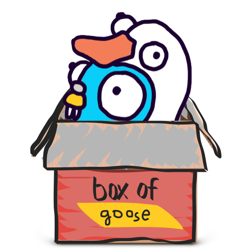

# [goose-docker](https://github.com/kukymbr/goose-docker)

[](https://github.com/kukymbr/goose-docker/blob/master/LICENSE)
[](https://github.com/kukymbr/goose-docker/releases/latest)
[](https://github.com/kukymbr/goose-docker/actions/workflows/tests.yml)
[](https://github.com/kukymbr/goose-docker/actions/workflows/push_ghcr.yml)
[](https://github.com/kukymbr/goose-docker/actions/workflows/push_dockerhub.yml)

Docker configuration for the [pressly/goose](https://github.com/pressly/goose) migration tool.

Based on ideas of the `gomicro/docker-goose` repository.
Features:
* No need to create your own Dockerfile;
* goose env vars are used;
* docker compose usage;
* all goose commands are available, not only `up`;
* an image with a gopher in a goose costume in a box is even worse than an image with a gopher in a goose costume.

## Usage

### Image Environment Variables

The following environment variables are required for the image to work correctly:

- `GOOSE_DRIVER`: this should specify the database driver (e.g., `postgres`).
- `GOOSE_DBSTRING`: specify the database connection parameters in this variable 
  (e.g., `host=localhost port=5432 user=postgres password=postgres dbname=postgres`).

The following environment variables are available, but not required:

- `GOOSE_COMMAND`: the goose command to execute, `up` by default.
- `GOOSE_COMMAND_ARG`: argument for the goose command,
  for example, the `VERSION` argument for the `up-to`/`down-to` commands.
- `GOOSE_VERBOSE`: if set to `true`, goose will be executed with the `-v` flag.
- `GOOSE_EXTRA_ARGS`: additional goose arguments, for example `GOOSE_EXTRA_ARGS="-table=_db_version -allow-missing"`
  (available in the `latest` tag only until the next goose release).

See the [goose usage](https://github.com/pressly/goose#usage) 
for available drivers, format of the connection string and available commands.

#### .env file for a goose

To pass environment variables to the goose via the `.env` file 
(available in goose since v3.24.0, 
see the [goose doc](https://github.com/pressly/goose#environment-variables) for info),
mount `.env` file to the `/goose-docker` directory, for example:

```shell
docker run --rm -v ./migrations:/migrations -v my_goose.env:/goose-docker/.env --network host \
  -e GOOSE_DRIVER="postgres" \
  -e GOOSE_DBSTRING="host=localhost port=5432 user=postgres password=postgres dbname=postgres" \
  ghcr.io/kukymbr/goose-docker:3.24.2
```

### Migration Files Directory

The image expects the `/migrations` directory to be mounted to the container, 
and it should contain your migration files.

### Example Usage

For example, pure docker call:

```shell
docker run --rm -v ./migrations:/migrations --network host \
  -e GOOSE_DRIVER="postgres" \
  -e GOOSE_DBSTRING="host=localhost port=5432 user=postgres password=postgres dbname=postgres" \
  ghcr.io/kukymbr/goose-docker:3.24.2
```

Example with `up-to` command:

```shell
docker run --rm -v ./migrations:/migrations --network host \
  -e GOOSE_COMMAND="up-to" \
  -e GOOSE_COMMAND_ARG="20230607203836" \
  -e GOOSE_DRIVER="postgres" \
  -e GOOSE_DBSTRING="host=localhost port=5432 user=postgres password=postgres dbname=postgres" \
  ghcr.io/kukymbr/goose-docker:3.24.2
```

Example with `create` command (works since v3.20.0):

```shell
docker run --rm -v ./migrations:/migrations \
  -e GOOSE_COMMAND="create" \
  -e GOOSE_COMMAND_ARG="my_new_migration_name sql" \
  ghcr.io/kukymbr/goose-docker:latest
```

### docker compose

Docker compose example:

```yaml
services:
  # ... Add your DB service
  
  migrations:
    image: ghcr.io/kukymbr/goose-docker:3.24.2
    environment:
      - GOOSE_DRIVER=postgres
      - GOOSE_DBSTRING=host=postgres port=5432 user=postgres password=postgres dbname=postgres
    volumes:
      - ./migrations:/migrations
```

See the [compose.yml](compose.yml) file for the full example.
Also, the [tests/compose.yml](tests/compose.yml) file contains example of usage with multiple databases.

#### Overriding the environment variables

If you need to dynamically override the environment values provided in the docker compose or in the .env files,
add these variables into the `environment` section with a placeholder as a value, for example:

```yaml
migrations:
  # ...
  environment:
    - GOOSE_COMMAND=${GOOSE_COMMAND}
    - GOOSE_COMMAND_ARG=${GOOSE_COMMAND_ARG}
```

When you can override the values:

```shell
GOOSE_COMMAND="create" GOOSE_COMMAND_ARG="test_migration sql" docker compose run --rm migrations
```

### Embedding migrations files

If you don't want or don't have an option to add migrations files as a volume,
create a `Dockerfile` extending the `goose-docker` image and add your files into it:

```Dockerfile
FROM ghcr.io/kukymbr/goose-docker:3.24.2

ADD /path/to/migrations /migrations
```

Then build it and use it instead of the `goose-docker` image as usual.

### amd64/arm64 architecture

The ARM64 architecture support is added since the v3.23.0.

### The `latest` tag notice

The `latest` tag of this image points to the latest commit to the `main` branch 
and not supposed to be used in the production. Always specify a semver tag for production use.

## Contributing

Please, refer the [CONTRIBUTING.md](CONTRIBUTING.md) for contribution info.

## License

[MIT licensed](LICENSE).
